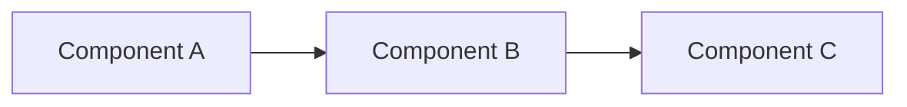

# Documentation Maintenance Guide

---
**Last Updated:** 2025-01-17
**Maintained By:** Documentation Agent and contributors
**Version:** 1.0

---

## Purpose

This guide provides comprehensive instructions for maintaining, creating, and updating Rustbot documentation. It ensures consistency, quality, and discoverability across all documentation.

---

## Table of Contents

1. [Documentation Structure](#documentation-structure)
2. [Creating New Documentation](#creating-new-documentation)
3. [Updating Existing Documentation](#updating-existing-documentation)
4. [File Organization](#file-organization)
5. [Templates](#templates)
6. [Link Management](#link-management)
7. [Maintenance Schedule](#maintenance-schedule)
8. [Quality Standards](#quality-standards)

---

## Documentation Structure

### Directory Organization

```
docs/
├── README.md                    # Main documentation hub
├── MAINTENANCE.md (this file)   # Maintenance guide
│
├── architecture/                # Architecture & design
│   ├── README.md
│   ├── best-practices/
│   ├── planning/
│   ├── implementation/
│   └── diagrams/
│
├── guides/                      # User guides & tutorials
│   └── README.md
│
├── qa/                          # Quality assurance
│   └── README.md
│
├── reviews/                     # Documentation reviews
│   └── README.md
│
├── progress/                    # Session logs
│   └── YYYY-MM-DD-*.md
│
└── fixes/                       # Bug fixes
    └── YYYY-MM-DD-*.md
```

### Categorization Rules

| Document Type | Location | Example |
|---------------|----------|---------|
| Architecture design & patterns | `architecture/best-practices/` | `RUST_ARCHITECTURE_BEST_PRACTICES.md` |
| Refactoring plans | `architecture/planning/` | `RUSTBOT_REFACTORING_PLAN.md` |
| Implementation summaries | `architecture/implementation/` | `PHASE1_IMPLEMENTATION_SUMMARY.md` |
| Architecture diagrams | `architecture/diagrams/` | `ARCHITECTURE_DIAGRAMS.md` |
| User guides | `guides/` | `QUICK_START.md` |
| Testing documentation | `qa/` | `TESTING_METHODS.md` |
| Documentation reviews | `reviews/` | `DOCUMENTATION_REVIEW.md` |
| Session logs | `progress/` | `2025-01-17-session.md` |
| Bug fixes | `fixes/` | `2025-01-14-fix.md` |

---

## Creating New Documentation

### Step-by-Step Process

#### 1. Check for Existing Documentation

Before creating new documentation:

```bash
# Search for related topics
find docs -name "*.md" | xargs grep -l "your topic"

# Check directory READMEs
cat docs/architecture/README.md
cat docs/guides/README.md
cat docs/qa/README.md
cat docs/reviews/README.md
```

#### 2. Choose Appropriate Location

Use the categorization rules above to determine the correct directory.

#### 3. Choose File Name

**Naming Conventions:**

- **Major documentation:** SCREAMING_SNAKE_CASE
  - Examples: `ARCHITECTURE.md`, `API.md`, `TESTING_METHODS.md`

- **Topic-specific docs:** SCREAMING_SNAKE_CASE with topic prefix
  - Examples: `RUST_ARCHITECTURE_BEST_PRACTICES.md`, `REFACTORING_CHECKLIST.md`

- **Progress logs:** `YYYY-MM-DD-topic-description.md`
  - Examples: `2025-01-17-architecture-refactoring-session.md`

- **Fix documentation:** `YYYY-MM-DD-issue-description.md`
  - Examples: `2025-01-14-marketplace-dedup-fix.md`

#### 4. Use Appropriate Template

See [Templates](#templates) section below.

#### 5. Add Metadata Header

```markdown
---
title: Document Title
category: Architecture | Guide | QA | Review | Progress | Fix
audience: Developer | PM | QA | Architect | All
reading_time: X minutes
last_updated: YYYY-MM-DD
status: Complete | Draft | In Progress | Deprecated
---
```

#### 6. Write Content

Follow [Quality Standards](#quality-standards) below.

#### 7. Update Directory README

Add entry to the relevant directory's README.md:

```markdown
- **[Your Document](path/to/document.md)** - Brief description
  - Reading time: ~X minutes
  - Audience: [Target audience]
  - Covers: [Key topics]
```

#### 8. Update Main README (if major)

For major documentation additions, update `docs/README.md` navigation sections.

#### 9. Validate Links

```bash
# Check all links work
grep -r "\[.*\](.*\.md)" docs/your-new-document.md

# Verify referenced files exist
```

---

## Updating Existing Documentation

### Update Checklist

- [ ] Update `last_updated` metadata field
- [ ] Review and update outdated content
- [ ] Verify all links still work
- [ ] Update code examples if APIs changed
- [ ] Check cross-references are still accurate
- [ ] Update screenshots/diagrams if needed
- [ ] Consider changing status (Draft → Complete, Complete → Deprecated)

### When to Update

**Immediate updates required:**
- Code changes that affect documented APIs
- Architectural changes
- Deprecated features
- Broken links or references

**Regular review updates:**
- Monthly: Review recent documentation
- Quarterly: Comprehensive review of all docs
- After major releases: Update version-specific content

### Deprecation Process

When documentation becomes outdated:

1. **Mark as deprecated:**
   ```markdown
   ---
   status: Deprecated
   deprecated_date: YYYY-MM-DD
   replacement: path/to/new/document.md
   ---

   # Document Title

   > **⚠️ DEPRECATED:** This document is outdated. See [New Document](path/to/new/document.md) instead.
   ```

2. **Update cross-references** to point to replacement

3. **Archive after 3 months** (move to `docs/archive/`)

---

## File Organization

### Moving Files

**Always use `git mv` to preserve history:**

```bash
# Move single file
git mv docs/OLD_LOCATION.md docs/new-location/NEW_NAME.md

# Move multiple files
git mv docs/*.md docs/new-location/
```

### After Moving Files

1. **Update all references:**
   ```bash
   # Find all references to moved file
   grep -r "OLD_LOCATION.md" docs/

   # Update each reference to new location
   ```

2. **Update directory READMEs**

3. **Update main README if needed**

4. **Validate all links**

### Archiving Old Documentation

For historical documentation that's no longer active:

```bash
# Create archive directory if needed
mkdir -p docs/archive/category/YYYY-MM/

# Move old docs
git mv docs/old-doc.md docs/archive/category/YYYY-MM/

# Update index
```

---

## Templates

### Architecture Document Template

```markdown
---
title: [Feature/System] Architecture
category: Architecture
audience: Developer, Architect
reading_time: 20 minutes
last_updated: YYYY-MM-DD
status: Complete
---

# [Feature/System] Architecture

## Overview

Brief description of what this document covers and why it exists.

## Goals

- Goal 1
- Goal 2
- Goal 3

## Design Principles

Key principles guiding the architecture.

## System Components

### Component 1

Description, responsibilities, and interfaces.

### Component 2

Description, responsibilities, and interfaces.

## Data Flow

Describe how data flows through the system. Include diagrams.



## Implementation Details

### Technology Stack

- Technology 1: Purpose
- Technology 2: Purpose

### Key Patterns

- Pattern 1: Usage and rationale
- Pattern 2: Usage and rationale

## Trade-offs and Decisions

Document key architectural decisions and their rationale.

## Testing Strategy

How this architecture supports testing.

## Future Considerations

Potential improvements and extensions.

## References

- [Related Doc 1](path/to/doc1.md)
- [Related Doc 2](path/to/doc2.md)
- External resources
```

### Guide Template

```markdown
---
title: [Feature] Quick Start Guide
category: Guide
audience: Developer, All
reading_time: 10 minutes
last_updated: YYYY-MM-DD
status: Complete
---

# [Feature] Quick Start Guide

## Overview

Brief description of what this guide covers and who it's for.

## Prerequisites

- Prerequisite 1
- Prerequisite 2
- Required knowledge

## Step 1: [First Step Name]

Detailed instructions for the first step.

```bash
# Example command
command --flag value
```

**Expected output:**
```
Example output
```

## Step 2: [Second Step Name]

Detailed instructions for the second step.

## Step 3: [Third Step Name]

Continue with clear, numbered steps.

## Verification

How to verify everything is working correctly.

```bash
# Verification command
test-command
```

## Troubleshooting

### Issue 1: [Common Problem]

**Symptoms:** Description

**Solution:** Step-by-step fix

### Issue 2: [Another Problem]

**Symptoms:** Description

**Solution:** Step-by-step fix

## Next Steps

- [Advanced Topic](path/to/advanced.md)
- [Related Feature](path/to/related.md)

## References

- [Related documentation](path)
- External resources
```

### QA Document Template

```markdown
---
title: [Feature] Testing Guide
category: QA
audience: QA, Developer
reading_time: 15 minutes
last_updated: YYYY-MM-DD
status: Complete
---

# [Feature] Testing Guide

## Overview

What this testing guide covers.

## Scope

What is included and excluded from testing.

## Test Environment Setup

### Prerequisites

- Requirement 1
- Requirement 2

### Setup Steps

1. Step 1
2. Step 2

## Test Cases

### TC-001: [Test Case Name]

**Objective:** What this test validates

**Preconditions:**
- Condition 1
- Condition 2

**Test Steps:**
1. Step 1
2. Step 2
3. Step 3

**Expected Result:**
- Result 1
- Result 2

**Actual Result:**
[To be filled during testing]

**Status:** Pass | Fail | Blocked

### TC-002: [Another Test Case]

[Repeat structure]

## Test Results Summary

| Test Case | Status | Notes |
|-----------|--------|-------|
| TC-001 | Pass | |
| TC-002 | Fail | See issue #123 |

## Issues Found

### Issue 1: [Issue Description]

**Severity:** Critical | High | Medium | Low

**Steps to Reproduce:**
1. Step 1
2. Step 2

**Expected:** What should happen

**Actual:** What actually happens

**Impact:** How this affects users

## Recommendations

- Recommendation 1
- Recommendation 2

## Sign-off

- **Tested by:** Name
- **Date:** YYYY-MM-DD
- **Status:** Approved | Rejected | Conditional
```

### Progress Log Template

```markdown
---
title: [Date] - [Topic] Session
category: Progress
audience: All
reading_time: 10 minutes
last_updated: YYYY-MM-DD
status: Complete
---

# [Date] - [Topic] Development Session

## Session Overview

**Date:** YYYY-MM-DD
**Duration:** X hours
**Goals:** Brief summary of session goals

## Objectives

- [ ] Objective 1
- [ ] Objective 2
- [ ] Objective 3

## Features Implemented

### Feature 1: [Name]

**Description:** What was implemented

**Changes:**
- Change 1
- Change 2

**Files Modified:**
- `path/to/file1.rs` - Description
- `path/to/file2.rs` - Description

### Feature 2: [Name]

[Repeat structure]

## Technical Details

### Key Design Decisions

1. **Decision 1:** Rationale
2. **Decision 2:** Rationale

### Implementation Approach

Description of implementation strategy.

### Challenges Encountered

1. **Challenge 1:** How it was resolved
2. **Challenge 2:** How it was resolved

## Testing

**Test Coverage:**
- Unit tests: Description
- Integration tests: Description
- Manual testing: Description

**Test Results:**
- All tests passing: Yes/No
- Known issues: Description

## Git Commits

```
abc1234 feat: implement feature 1
def5678 fix: resolve issue in feature 2
ghi9012 docs: update documentation
```

## Documentation Updates

- Updated: `docs/path/to/doc.md`
- Created: `docs/path/to/new-doc.md`

## Next Steps

### Immediate Follow-ups
- [ ] Task 1
- [ ] Task 2

### Future Enhancements
- Enhancement 1
- Enhancement 2

## Related Resources

- [Related Doc 1](path/to/doc1.md)
- [Issue #123](link)
- [PR #456](link)
```

### Review Template

```markdown
---
title: [Subject] Review - [Date]
category: Review
audience: All
reading_time: 15 minutes
last_updated: YYYY-MM-DD
status: Complete
---

# [Subject] Review - [Date]

## Overview

**Review Date:** YYYY-MM-DD
**Reviewer(s):** Name(s)
**Scope:** What was reviewed

## Purpose

Why this review was conducted.

## Methodology

How the review was conducted:
- Approach 1
- Approach 2

## Findings

### Critical Issues

Issues requiring immediate attention.

#### Issue 1: [Description]

**Location:** `path/to/file.md:123`

**Problem:** Detailed description

**Impact:** High | Medium | Low

**Recommendation:** Specific actionable recommendation

### Important Issues

Issues that should be addressed soon.

### Recommendations

Suggested improvements and enhancements.

## Positive Findings

What was done well:
- Good practice 1
- Good practice 2

## Action Items

- [ ] **[Priority]** Action 1 - Owner, Due Date
- [ ] **[Priority]** Action 2 - Owner, Due Date

## Metrics

| Metric | Value | Target | Status |
|--------|-------|--------|--------|
| Coverage | 85% | 90% | ⚠️ Below |
| Accuracy | 95% | 95% | ✅ Met |

## Conclusion

Summary of review findings and next steps.

## Follow-up

**Next Review:** YYYY-MM-DD
**Tracking:** Link to tracking issue/document
```

---

## Link Management

### Internal Links

**Format:**
```markdown
[Link Text](relative/path/to/document.md)
[Link Text](relative/path/to/document.md#section-heading)
```

**Examples:**
```markdown
[Architecture Guide](architecture/README.md)
[Best Practices](architecture/best-practices/RUST_ARCHITECTURE_BEST_PRACTICES.md)
[Specific Section](guides/QUICK_START.md#installation)
```

### Validating Links

```bash
# Find all markdown links in a file
grep -o '\[.*\](.*\.md[^)]*)' docs/your-file.md

# Find all markdown links in docs/
find docs -name "*.md" -exec grep -H '\[.*\](.*\.md[^)]*)' {} \;

# Check if linked files exist
# (manual verification needed)
```

### Updating Links After Moving Files

1. **Find all references:**
   ```bash
   grep -r "old-path/OLD_FILE.md" docs/
   ```

2. **Update each reference** to new path

3. **Verify with:**
   ```bash
   grep -r "new-path/NEW_FILE.md" docs/
   ```

---

## Maintenance Schedule

### Daily

- [ ] Create progress logs for significant work sessions
- [ ] Update documentation for code changes

### Weekly

- [ ] Review new documentation for completeness
- [ ] Check recent documentation links
- [ ] Update progress logs directory README if needed

### Monthly

- [ ] Review all recent documentation for accuracy
- [ ] Update cross-references and links
- [ ] Archive old progress logs (>1 month) if needed
- [ ] Update directory READMEs
- [ ] Verify main README is current

### Quarterly

- [ ] Comprehensive documentation review
- [ ] Update all architecture docs
- [ ] Review and update best practices
- [ ] Consolidate or archive redundant content
- [ ] Update templates if needed
- [ ] Review and update this maintenance guide

### Annually

- [ ] Complete documentation audit
- [ ] Archive old fixes and progress logs
- [ ] Review documentation structure
- [ ] Update documentation standards
- [ ] Plan improvements for next year

---

## Quality Standards

### Content Quality

**Every document must:**

- [ ] Have clear, descriptive title
- [ ] Include metadata header
- [ ] State purpose in overview/introduction
- [ ] Be well-organized with logical sections
- [ ] Use consistent formatting
- [ ] Include examples where appropriate
- [ ] Have correct spelling and grammar
- [ ] Use active voice
- [ ] Be concise yet complete

### Technical Accuracy

- [ ] Code examples are tested and working
- [ ] API references match current implementation
- [ ] Architecture diagrams reflect current state
- [ ] Version-specific information is accurate
- [ ] Links point to correct locations

### Accessibility

- [ ] Clear heading hierarchy (H1 → H2 → H3)
- [ ] Descriptive link text (not "click here")
- [ ] Alt text for images (when images added)
- [ ] Tables have headers
- [ ] Lists are properly formatted

### Discoverability

- [ ] File named clearly and descriptively
- [ ] Listed in directory README
- [ ] Linked from related documents
- [ ] Included in main README if major
- [ ] Has relevant cross-references

### Maintainability

- [ ] Single source of truth (no duplication)
- [ ] Clear ownership/maintenance responsibility
- [ ] Last updated date is current
- [ ] Deprecation path is clear if outdated
- [ ] Related documents are cross-referenced

---

## Common Maintenance Tasks

### Task 1: Adding a New Architecture Document

```bash
# 1. Create file
touch docs/architecture/planning/NEW_DOCUMENT.md

# 2. Add metadata header (use template above)

# 3. Write content

# 4. Update directory README
edit docs/architecture/README.md

# 5. Update main README (if major)
edit docs/README.md

# 6. Commit changes
git add docs/architecture/planning/NEW_DOCUMENT.md
git add docs/architecture/README.md
git commit -m "docs: add [topic] architecture document"
```

### Task 2: Moving a Document

```bash
# 1. Move file with git
git mv docs/OLD_LOCATION.md docs/new-location/NEW_NAME.md

# 2. Find all references
grep -r "OLD_LOCATION.md" docs/

# 3. Update each reference to new path

# 4. Update directory READMEs

# 5. Commit changes
git add -A
git commit -m "docs: reorganize [topic] documentation"
```

### Task 3: Deprecating a Document

```bash
# 1. Add deprecation notice to top of file
# 2. Update metadata: status: Deprecated
# 3. Update all cross-references to point to replacement
# 4. Update directory README
# 5. After 3 months, archive to docs/archive/
```

### Task 4: Creating a Progress Log

```bash
# 1. Create file with proper naming
touch docs/progress/$(date +%Y-%m-%d)-topic-name.md

# 2. Use progress log template
# 3. Document session work
# 4. Commit at end of session
git add docs/progress/$(date +%Y-%m-%d)-topic-name.md
git commit -m "docs: add session log for [topic]"
```

---

## Best Practices

### Writing Style

1. **Be concise** - Every word should add value
2. **Be specific** - Use concrete examples
3. **Be consistent** - Follow established patterns
4. **Be clear** - Prefer simple language over complex
5. **Be complete** - Cover all necessary aspects

### Organization

1. **One topic, one document** - Don't combine unrelated topics
2. **Clear hierarchy** - Use proper heading levels
3. **Logical flow** - Information should build naturally
4. **Scannable** - Use lists, tables, and formatting
5. **Cross-reference** - Link to related information

### Maintenance

1. **Keep current** - Update as code changes
2. **No duplication** - Single source of truth
3. **Preserve history** - Archive, don't delete
4. **Regular reviews** - Follow maintenance schedule
5. **Track changes** - Use git commits effectively

---

## Troubleshooting

### Problem: Can't find where to put new documentation

**Solution:**
1. Review [Categorization Rules](#categorization-rules)
2. Check similar existing documents
3. Review directory READMEs
4. Ask in project communications if still unsure

### Problem: Links broken after moving files

**Solution:**
1. Always use `git mv` to move files
2. Search for all references: `grep -r "old-name.md" docs/`
3. Update each reference
4. Validate all links in affected files

### Problem: Documentation is outdated

**Solution:**
1. Mark as deprecated if replacement exists
2. Update content if still relevant
3. Archive if no longer needed
4. Update cross-references

### Problem: Duplicate content exists

**Solution:**
1. Determine authoritative version
2. Consolidate content into single document
3. Add redirects/links from old locations
4. Archive or delete duplicates
5. Update cross-references

---

## Tools and Scripts

### Link Validator (Bash)

```bash
#!/bin/bash
# validate-links.sh - Check all markdown links in docs/

find docs -name "*.md" | while read file; do
    echo "Checking: $file"
    grep -o '\[.*\]([^)]*\.md[^)]*)' "$file" | while read link; do
        path=$(echo "$link" | sed 's/.*(\([^)]*\)).*/\1/')
        dir=$(dirname "$file")
        if [ ! -f "$dir/$path" ]; then
            echo "  BROKEN: $link in $file"
        fi
    done
done
```

### Documentation Statistics

```bash
#!/bin/bash
# doc-stats.sh - Generate documentation statistics

echo "Documentation Statistics"
echo "======================="
echo ""
echo "Total markdown files: $(find docs -name "*.md" | wc -l)"
echo "Total lines: $(find docs -name "*.md" -exec wc -l {} + | tail -1)"
echo ""
echo "Files by directory:"
find docs -type d | while read dir; do
    count=$(find "$dir" -maxdepth 1 -name "*.md" | wc -l)
    if [ $count -gt 0 ]; then
        echo "  $dir: $count"
    fi
done
```

---

## Version History

| Version | Date | Changes |
|---------|------|---------|
| 1.0 | 2025-01-17 | Initial version with comprehensive templates and guidelines |

---

## Additional Resources

- [Documentation README](README.md) - Main documentation index
- [Development Guide](../DEVELOPMENT.md) - Development workflow
- [CLAUDE.md](../CLAUDE.md) - AI assistant integration

---

**Questions or Suggestions?**

If you have questions about documentation maintenance or suggestions for improving this guide, please update this document or create an issue for discussion.
