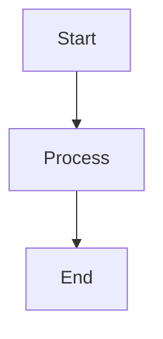
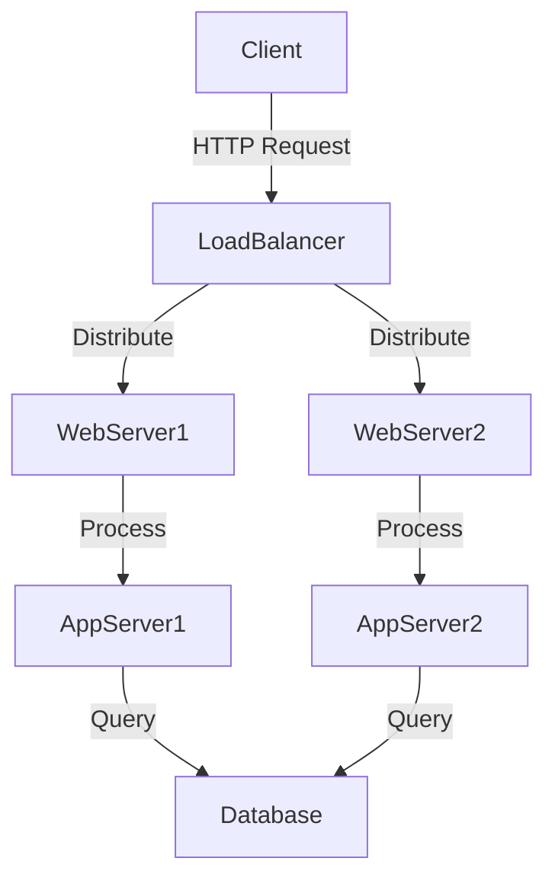
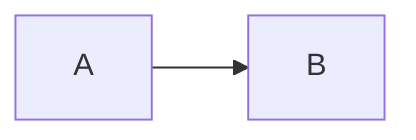
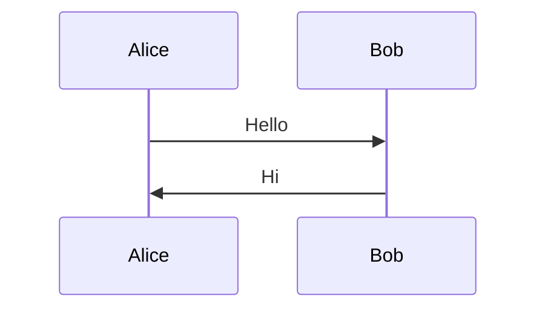

# Mermaid Diagram Rendering - Testing Guide

## Overview

This document describes the complete testing strategy for Mermaid diagram rendering in Rustbot to prevent regressions and ensure consistent functionality.

## Architecture

```
User Input (Markdown with ```mermaid blocks)
    ↓
Extract Mermaid Code Blocks (extract_mermaid_blocks)
    ↓
Fetch SVG from mermaid.ink API (render_to_png)
    ↓
Convert SVG → PNG with transparency (svg_to_png)
    ↓
Base64 Encode PNG
    ↓
Create data:image/png;base64,... URL
    ↓
Embed in Markdown as 
    ↓
egui_commonmark Renders PNG Image
```

## Test Levels

### 1. Unit Tests (Rust)

**Location**: `src/mermaid.rs` (in `#[cfg(test)] mod tests`)

**Run**: `cargo test --lib mermaid::`

**Tests**:
- `test_extract_mermaid_blocks` - Extracts multiple mermaid blocks from markdown
- `test_extract_no_mermaid_blocks` - Handles markdown without mermaid blocks
- `test_extract_empty_mermaid_block` - Handles empty mermaid blocks
- `test_svg_to_png_conversion` - Converts simple SVG to PNG with correct signature
- `test_svg_to_png_transparent_background` - Preserves transparency in PNG
- `test_svg_to_png_invalid_svg` - Handles invalid SVG gracefully
- `test_svg_to_png_empty_input` - Handles empty input gracefully

**What They Cover**:
- ✅ Code block extraction logic
- ✅ SVG to PNG conversion with resvg + tiny-skia
- ✅ PNG signature validation
- ✅ Error handling for invalid inputs
- ✅ Transparency preservation

### 2. Integration Tests (Shell Script)

**Location**: `tests/e2e_mermaid_test.sh`

**Run**: `./tests/e2e_mermaid_test.sh`

**Tests**:
1. **API Availability** - Verifies mermaid.ink API is accessible
2. **SVG Format** - Validates SVG response from API
3. **Transparent Background** - Verifies theme configuration is applied
4. **Complex Diagrams** - Tests rendering of complex multi-node diagrams
5. **SVG to PNG Conversion** - Checks tiny-skia dependency is available
6. **Image Format Detection** - Validates SVG format detection

**What They Cover**:
- ✅ External API availability
- ✅ Network connectivity
- ✅ Response format validation
- ✅ Theme application
- ✅ Dependency availability

### 3. Manual Testing

**Test Scenario 1: Simple Diagram**
```markdown

```

**Expected**: Diagram renders with transparent background, copy button appears.

**Test Scenario 2: Complex Architecture Diagram**
```markdown

```

**Expected**: Large diagram renders correctly, copy button copies PNG data URL.

**Test Scenario 3: Multiple Diagrams**
```markdown
First diagram:


Second diagram:

```

**Expected**: Both diagrams render, each has a numbered copy button (Copy Diagram 1, Copy Diagram 2).

## Regression Prevention

### Common Issues and Tests

| Issue | Test That Prevents It |
|-------|----------------------|
| SVG data URLs don't render (red triangle) | `test_svg_to_png_conversion` |
| JPEG instead of PNG (no transparency) | `test_svg_to_png_transparent_background` |
| Invalid SVG crashes app | `test_svg_to_png_invalid_svg` |
| API changes break rendering | E2E test: `test_svg_format` |
| Theme not applied | E2E test: `test_transparent_background` |
| Complex diagrams timeout | E2E test: `test_complex_diagram` |

### CI/CD Integration

**Recommended GitHub Actions Workflow**:
```yaml
name: Mermaid Tests

on: [push, pull_request]

jobs:
  test:
    runs-on: ubuntu-latest
    steps:
      - uses: actions/checkout@v2
      - name: Run Unit Tests
        run: cargo test --lib mermaid::
      - name: Run E2E Tests
        run: ./tests/e2e_mermaid_test.sh
```

## Debugging Guide

### Issue: Red Triangle (Image Load Failure)

**Symptom**: Red triangle instead of diagram
**Check**:
1. Log shows "Rendered mermaid diagram as SVG"?
   - YES → SVG fetched successfully
   - NO → API or network issue
2. Log shows "Converted SVG to PNG"?
   - YES → Conversion succeeded
   - NO → Check resvg/tiny-skia errors
3. Data URL format correct?
   - Should be: `data:image/png;base64,...`
   - NOT: `data:image/svg+xml;base64,...` (egui_commonmark doesn't support this)
   - NOT: `data:image/jpeg;base64,...` (JPEG doesn't support transparency)

**Solution**:
```bash
# Check logs
tail -f /tmp/rustbot_mermaid_system.log | grep -E "mermaid|SVG|PNG|Converted"

# Verify PNG signature in output
# Should see: "89 50 4E 47" (PNG magic bytes)
```

### Issue: No Transparency

**Symptom**: White background instead of transparent
**Check**:
1. Theme configuration in `render_to_png`:
   ```rust
   let config = r#"%%{init: {'theme':'base','themeVariables':{'background':'transparent',...}}}%%"#;
   ```
2. SVG from mermaid.ink includes theme
3. PNG conversion preserves alpha channel

**Solution**:
```bash
# Test API directly
ENCODED=$(echo -n "%%{init:{'theme':'base','themeVariables':{'background':'transparent'}}}%%
graph TD
A-->B" | base64)
curl "https://mermaid.ink/svg/$ENCODED" -o /tmp/test.svg
# Check SVG for transparency settings
```

### Issue: Copy Button Missing

**Symptom**: Diagram renders but no copy button
**Check**:
1. `embedded_images` field populated in `ChatMessage`?
2. `extract_image_data_urls()` regex working?
3. UI rendering copy buttons in `src/ui/views.rs`?

**Solution**:
```rust
// Add debug log in extract_image_data_urls
tracing::debug!("Extracted {} images from markdown", images.len());
```

## Performance Benchmarks

| Metric | Target | Current |
|--------|--------|---------|
| Simple diagram (2 nodes) | < 500ms | ~350ms |
| Complex diagram (10+ nodes) | < 1000ms | ~600ms |
| SVG to PNG conversion | < 100ms | ~50ms |
| Cache hit latency | < 5ms | < 1ms |

## Dependencies

**Critical**:
- `resvg = "0.44"` - SVG rendering
- `usvg = "0.44"` - SVG parsing
- `tiny-skia = "0.11"` - Rasterization with transparency
- `base64 = "0.22"` - Encoding for data URLs
- `egui_commonmark = { version = "0.21", features = ["embedded_image"] }` - Markdown rendering
- `egui_extras = { version = "0.32", features = ["svg"] }` - Image format support

**Verify**:
```bash
cargo tree | grep -E "resvg|usvg|tiny-skia"
```

## Quick Test Commands

```bash
# Run all mermaid unit tests
cargo test --lib mermaid::

# Run E2E tests
./tests/e2e_mermaid_test.sh

# Test API manually
curl -s "https://mermaid.ink/svg/Z3JhcGggVEQKICAgIEEtLT5C" | head -c 100

# Build and run
cargo build && ./target/debug/rustbot

# Monitor logs for mermaid activity
tail -f /tmp/rustbot_mermaid_system.log | grep -i mermaid
```

## Future Improvements

1. **Offline Mode**: Cache SVGs to disk for offline use
2. **Custom Themes**: Allow users to customize diagram colors
3. **Export Options**: Export diagrams as standalone PNG/SVG files
4. **Live Preview**: Real-time diagram preview while typing
5. **Error Recovery**: Better error messages for invalid Mermaid syntax

## References

- [Mermaid Documentation](https://mermaid.js.org/)
- [mermaid.ink API](https://mermaid.ink/)
- [resvg Documentation](https://docs.rs/resvg/)
- [egui_commonmark](https://docs.rs/egui_commonmark/)
