# Mermaid Diagrams in Rustbot - User Guide

Rustbot now supports rendering Mermaid diagrams directly in chat messages! This guide shows you how to create beautiful diagrams using simple text syntax.

## Quick Start

To create a diagram, use a code block with the `mermaid` language identifier:

````markdown
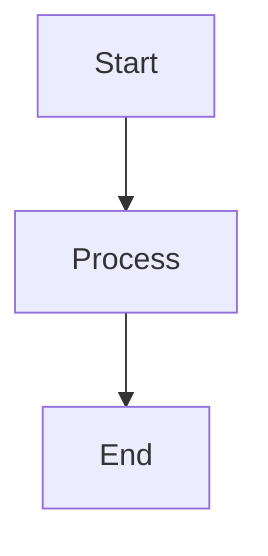
````

When you send this message, Rustbot will automatically render it as an interactive diagram instead of showing code.

## Supported Diagram Types

### 1. Flowcharts

Perfect for showing processes and decision flows:

````markdown
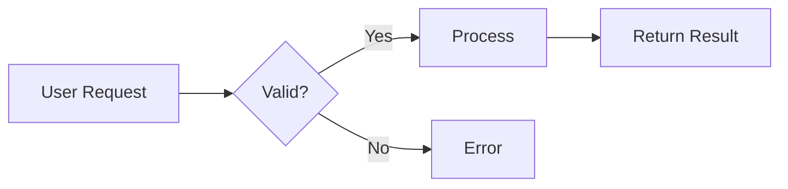
````

**Direction options:**
- `TD` or `TB` - Top to bottom
- `LR` - Left to right
- `RL` - Right to left
- `BT` - Bottom to top

### 2. Sequence Diagrams

Great for showing interactions between systems:

````markdown
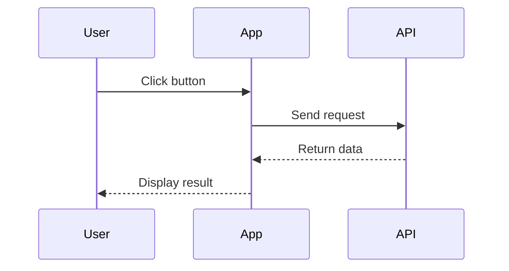
````

### 3. Class Diagrams

Document your code structure:

````markdown
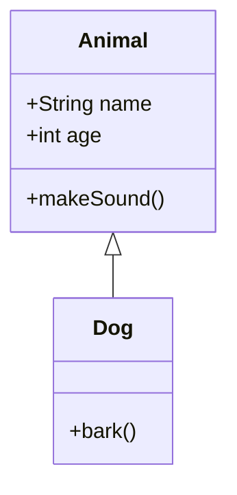
````

### 4. State Diagrams

Model state machines and workflows:

````markdown
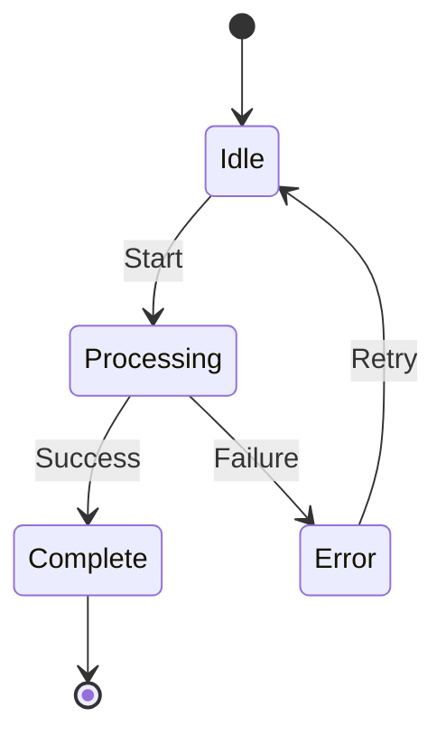
````

### 5. Entity Relationship Diagrams

Database schema visualization:

````markdown
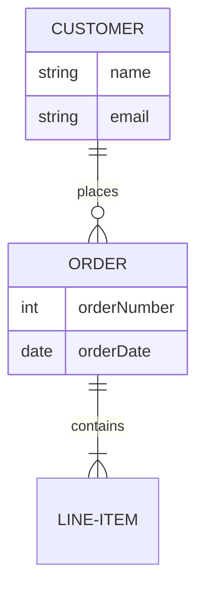
````

### 6. Gantt Charts

Project timelines and schedules:

````markdown
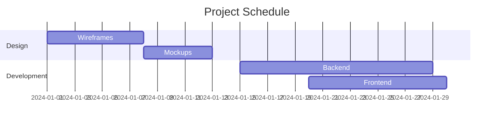
````

### 7. Pie Charts

Data distribution visualization:

````markdown
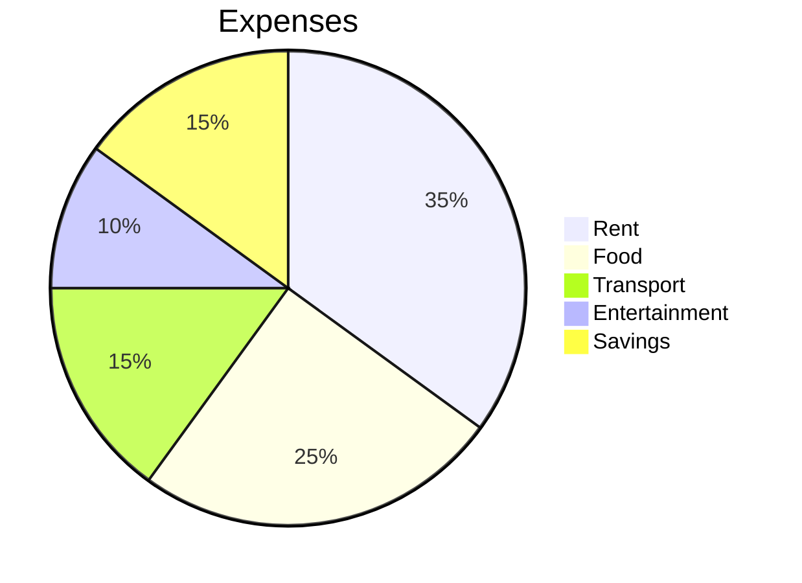
````

### 8. Git Graphs

Visualize branching strategies:

````markdown
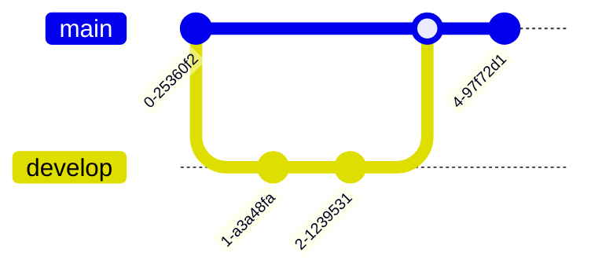
````

## Tips and Best Practices

### 1. Keep It Simple
- Start with simple diagrams
- Add complexity gradually
- Break large diagrams into smaller ones

### 2. Use Descriptive Labels
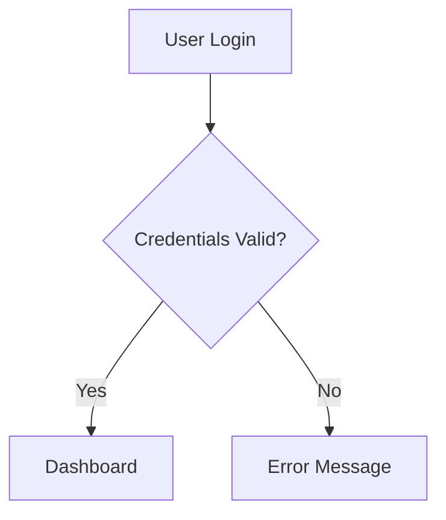
Better than: `A --> B`, `B --> C`

### 3. Leverage Colors (in some diagram types)
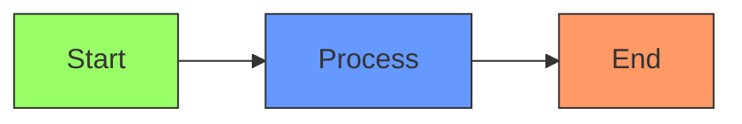

### 4. Add Comments


## Common Patterns

### Decision Tree
````markdown
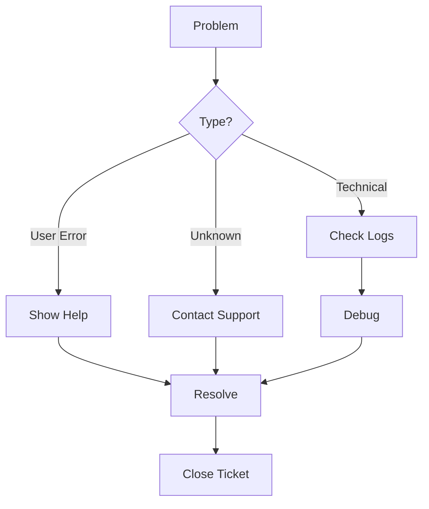
````

### System Architecture
````markdown
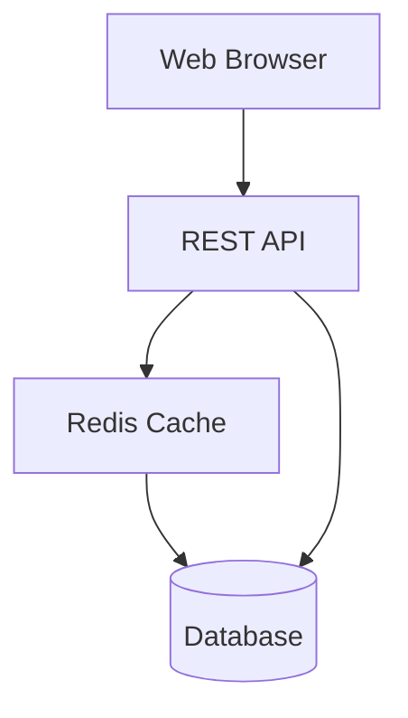
````

### Workflow Process
````markdown
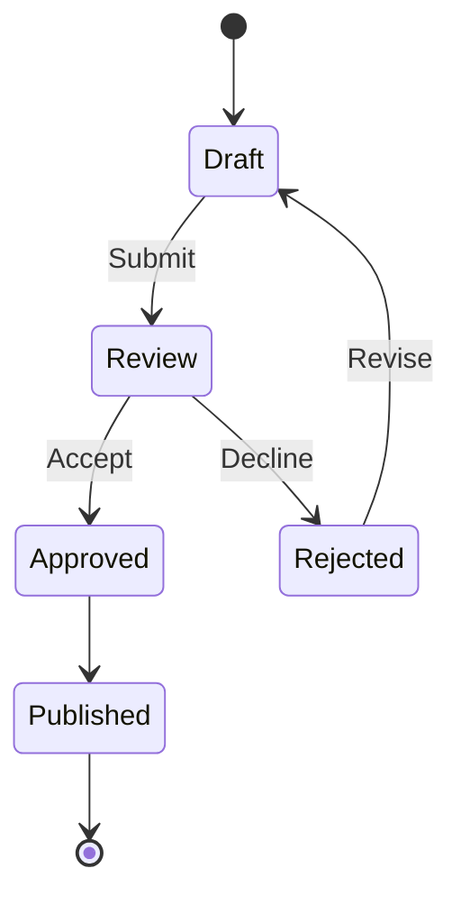
````

## Troubleshooting

### Diagram Not Rendering?

**Check syntax:**
- Must use ` ```mermaid` (with backticks)
- Syntax must be valid Mermaid code
- Try simplifying the diagram to isolate issues

**Network connection:**
- First render requires internet connection
- Cached diagrams work offline
- Check if you can access https://mermaid.ink

**Error messages:**
- Invalid syntax shows the code block instead
- Check console logs for detailed error messages

### Diagram Too Large?

If your diagram is very complex:
- Break it into multiple smaller diagrams
- Simplify node labels
- Reduce the number of connections
- Consider a different diagram type

### Caching Issues?

Diagrams are cached for performance:
- Same diagram content reuses cached render
- Changing diagram code creates new render
- Cache clears on app restart (for now)

## Performance Notes

**First Render:**
- Takes 100-500ms (network request to mermaid.ink)
- Subsequent views of same diagram are instant

**Cached Diagrams:**
- Render in <5ms
- No network request needed
- Cache persists during session

**Memory Usage:**
- Each diagram uses ~10-20KB
- Typical usage: <1MB total
- Cache size grows with unique diagrams

## Examples Gallery

See `MERMAID_EXAMPLES.md` for a comprehensive collection of example diagrams you can copy and modify.

## Learn More

**Official Mermaid Documentation:**
- https://mermaid.js.org/
- Comprehensive syntax reference
- Interactive live editor

**Quick Syntax Reference:**
- Flowchart: https://mermaid.js.org/syntax/flowchart.html
- Sequence: https://mermaid.js.org/syntax/sequenceDiagram.html
- Class: https://mermaid.js.org/syntax/classDiagram.html

**Try It Online:**
- Live Editor: https://mermaid.live/
- Test diagrams before using in Rustbot

## Privacy Note

⚠️ **Important:** Diagram code is sent to mermaid.ink API for rendering.

**What this means:**
- Your diagram content is transmitted over HTTPS
- mermaid.ink is a public, free service
- Diagrams are rendered server-side, not stored permanently

**Recommendations:**
- Don't include sensitive data in diagrams
- Don't include API keys, passwords, or secrets
- Keep confidential architecture details private
- Use generic labels for sensitive systems

**Future Enhancement:**
Local rendering option is planned for privacy-sensitive use cases.

## Feedback

Found a bug or have a suggestion?
- Report issues in the project repository
- Share example diagrams that don't render correctly
- Suggest diagram types you'd like to see supported

---

**Happy Diagramming!** 📊✨
