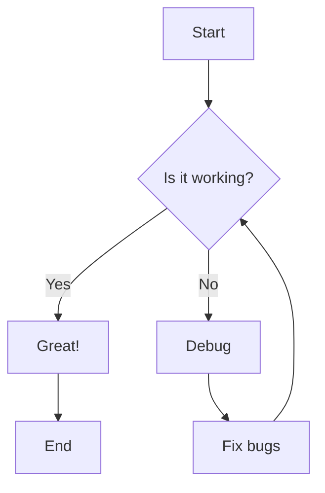
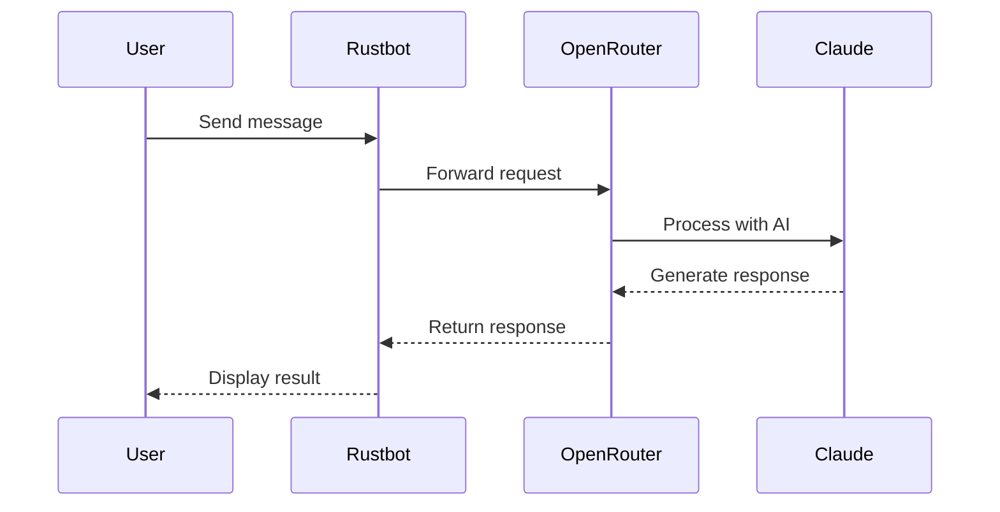
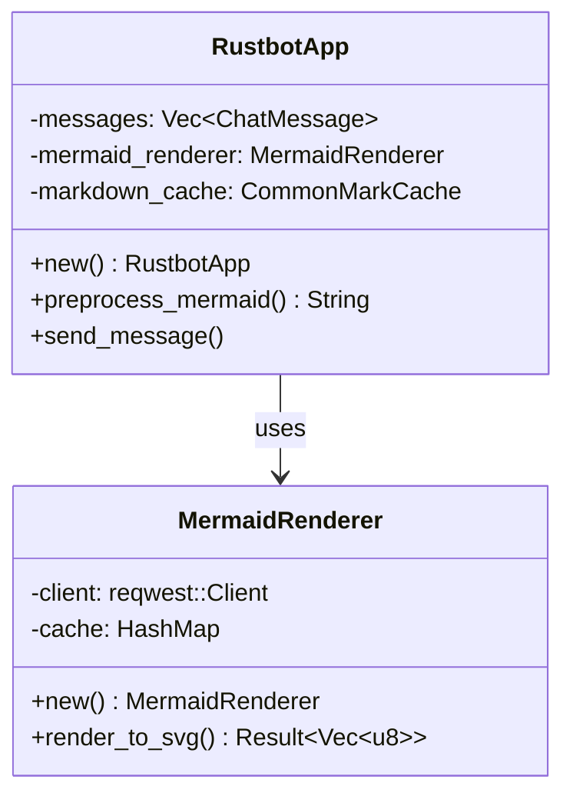
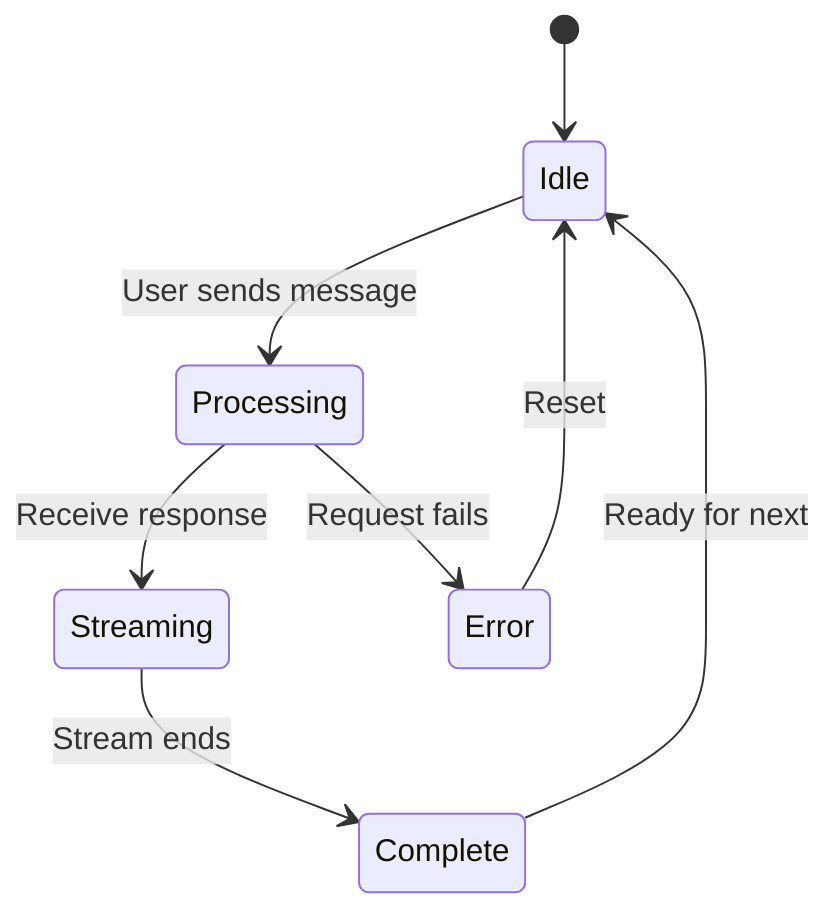
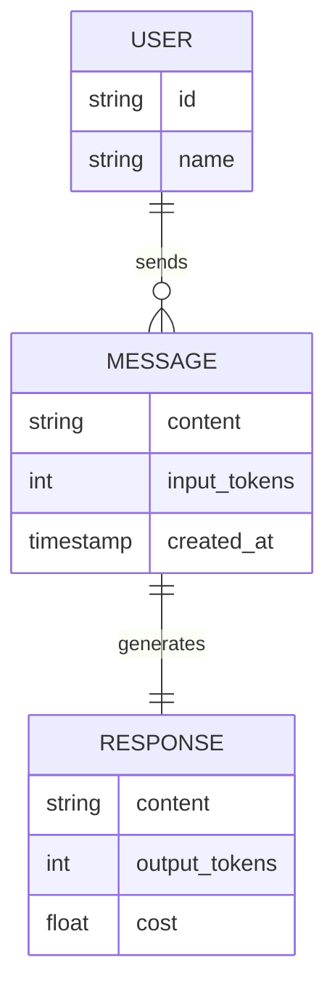
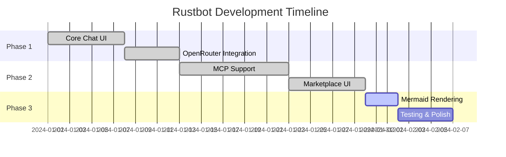
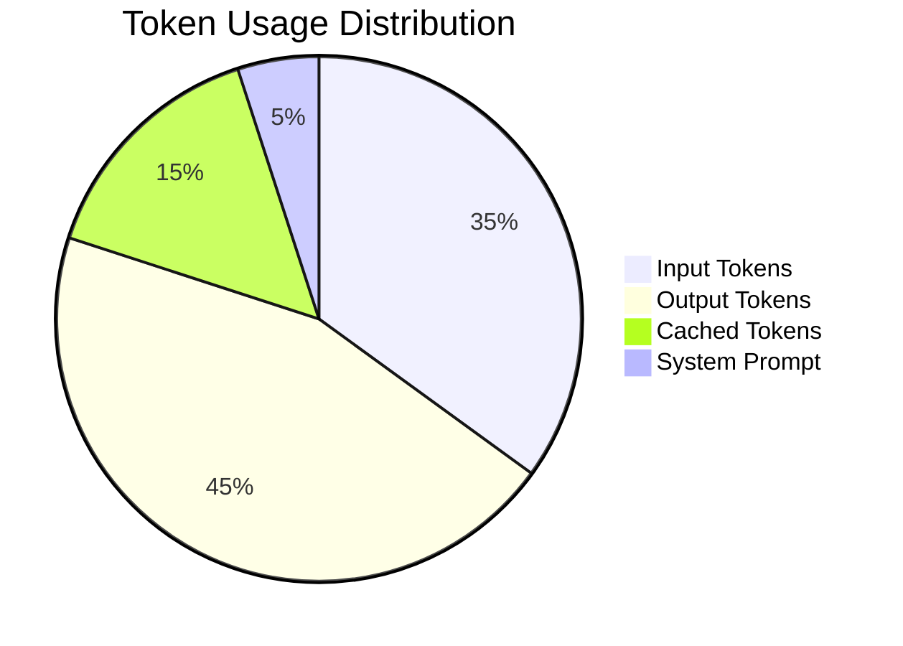
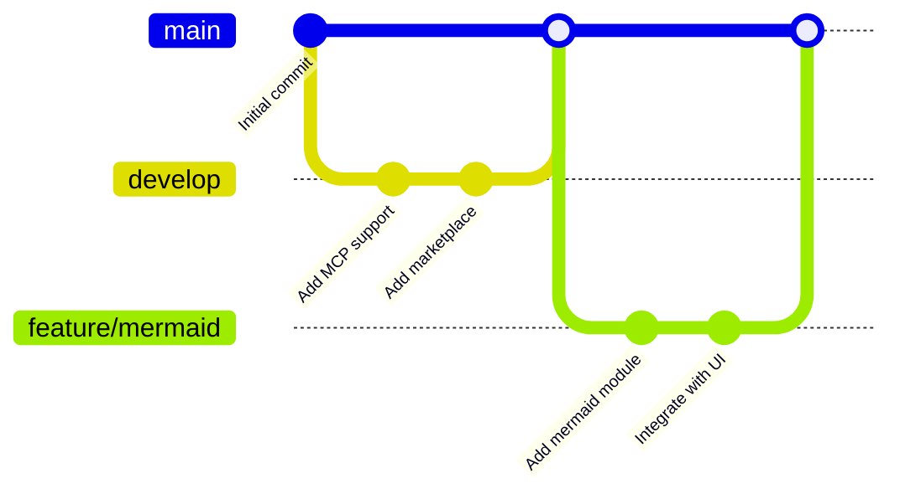

# Mermaid Diagram Examples for Testing

This document contains various Mermaid diagram examples to test the rendering functionality.

## Test 1: Flowchart



## Test 2: Sequence Diagram



## Test 3: Class Diagram



## Test 4: State Diagram



## Test 5: Entity Relationship Diagram



## Test 6: Gantt Chart



## Test 7: Pie Chart



## Test 8: Git Graph



## Instructions for Testing

To test these diagrams in Rustbot:

1. Build and run Rustbot: `cargo build && ./target/debug/rustbot`
2. Copy one of the mermaid code blocks above
3. Paste it into a chat message
4. Send the message
5. The diagram should render as an SVG image inline

## Expected Behavior

- ✅ Diagrams render as SVG images
- ✅ No network requests for cached diagrams
- ✅ Graceful fallback to code block on error
- ✅ Fast rendering (< 500ms for new diagrams)
- ✅ Clear error messages if syntax is invalid

## Error Testing

Test with invalid syntax:

```mermaid
graph TD
    A --> B
    C --> [Invalid syntax here
```

Expected: Should show code block or error message, not crash.
