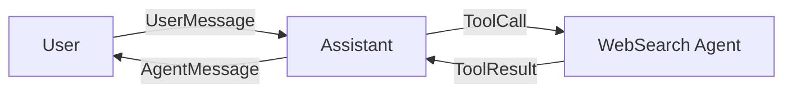

# Event Visualization System Design

**Date**: 2025-11-13
**Status**: Design Phase
**Version**: 1.0

## Requirements

1. **Sidebar**: Show only active (in-flight) events
2. **Separate Event Viewer Pane**: Detailed view with full history
3. **Visual Representation**: Mermaid-style flow diagram showing event relationships
4. **Auto-cleanup**: Remove completed/closed events from sidebar automatically
5. **Directional Flow**: Show event flow between actors with directional arrows

## Architecture Options

### Option 1: Mermaid.js + SVG Rendering (Hybrid Approach)

**Stack**:
- Generate Mermaid diagram syntax from event bus
- Use `mermaid-cli` (Node.js) to convert to SVG
- Display SVG in egui using `egui_extras` with `svg` feature

**Pros**:
- Professional diagram quality
- Mermaid syntax is standard and readable
- Easy to debug (can view .mmd files)

**Cons**:
- Requires Node.js runtime dependency
- External process overhead
- Not real-time (need to regenerate on update)

### Option 2: Native Graph Rendering with egui_graphs (Recommended)

**Stack**:
- Use `egui_graphs` crate for native Rust visualization
- Build graph from event bus data
- Real-time updates without external dependencies

**Pros**:
- ✅ Pure Rust, no external dependencies
- ✅ Real-time updates (built-in to egui)
- ✅ Interactive (can click nodes, zoom, pan)
- ✅ Hierarchical layout built-in
- ✅ Customizable styling

**Cons**:
- More code to write for layout logic
- Need to map events to graph structure

### Option 3: Hybrid - Mermaid Text + egui_graphs Rendering

**Stack**:
- Generate Mermaid-like syntax for debugging/export
- Render using `egui_graphs` for display
- Best of both worlds

**Pros**:
- ✅ Can export/save diagrams as text
- ✅ Real-time native rendering
- ✅ Human-readable event logs

**Cons**:
- Slightly more complex implementation

## Decision: Option 2 (Native with egui_graphs)

We'll use **egui_graphs** for pure Rust implementation with these benefits:
1. No external dependencies
2. Real-time updates
3. Interactive visualization
4. Future-proof for complex event flows

## UI Layout

```
┌─────────────────────────────────────────────────────────────┐
│ Sidebar (Left)                                              │
│ ┌─────────────────────────┐                                 │
│ │ Active Events (Live)    │                                 │
│ │ ─────────────────────   │                                 │
│ │ ● User → Assistant      │                                 │
│ │   "What's the weather?" │                                 │
│ │                         │                                 │
│ │ ● Assistant → WebSearch │                                 │
│ │   Delegating search...  │                                 │
│ └─────────────────────────┘                                 │
└─────────────────────────────────────────────────────────────┘

┌─────────────────────────────────────────────────────────────┐
│ Event Viewer Pane (Separate View/Modal)                     │
│ ┌─────────────────────────────────────────────────────────┐ │
│ │ Controls: [All Events] [Active Only] [Clear History]   │ │
│ ├─────────────────────────────────────────────────────────┤ │
│ │ Event Flow Visualization                                │ │
│ │                                                           │ │
│ │     ┌──────┐         ┌───────────┐        ┌──────────┐  │ │
│ │     │ User │ ──msg──>│ Assistant │ ──req──>│WebSearch │  │ │
│ │     └──────┘         └───────────┘        └──────────┘  │ │
│ │                            │                     │        │ │
│ │                            │<─────result─────────┘        │ │
│ │                            │                              │ │
│ │                      ┌─────▼─────┐                        │ │
│ │                      │ Response  │                        │ │
│ │                      └───────────┘                        │ │
│ └─────────────────────────────────────────────────────────┘ │
│ ┌─────────────────────────────────────────────────────────┐ │
│ │ Event History List                                      │ │
│ │ ─────────────────────────────────────────────────────   │ │
│ │ [15:45:23] User → Assistant: "What's the weather?"     │ │
│ │ [15:45:24] Assistant → WebSearch: Search request       │ │
│ │ [15:45:26] WebSearch → Assistant: Results returned     │ │
│ │ [15:45:27] Assistant → User: "Currently 72°F..."       │ │
│ └─────────────────────────────────────────────────────────┘ │
└─────────────────────────────────────────────────────────────┘
```

## Event Graph Structure

### Node Types

```rust
pub enum EventNodeType {
    User,
    Agent(String),      // Agent ID
    System,
}

pub struct EventNode {
    id: String,
    node_type: EventNodeType,
    label: String,
    timestamp: DateTime<Utc>,
    status: NodeStatus,  // Active, Completed, Error
}

pub enum NodeStatus {
    Active,     // Green
    Completed,  // Gray
    Error,      // Red
}
```

### Edge Types

```rust
pub struct EventEdge {
    from: String,       // Source node ID
    to: String,         // Target node ID
    event_kind: EventKind,
    label: String,
    timestamp: DateTime<Utc>,
}
```

### Example Event Flow Graph

```rust
// User asks question
User --[UserMessage]--> Assistant

// Assistant delegates to web search
Assistant --[ToolCall]--> WebSearch

// Web search returns result
WebSearch --[ToolResult]--> Assistant

// Assistant responds to user
Assistant --[AgentMessage]--> User
```

## Implementation Strategy

### Phase 1: Basic Graph Structure

1. Add `egui_graphs` dependency
2. Create `EventGraphBuilder` to convert events to graph
3. Implement basic rendering in Event Viewer pane

### Phase 2: Sidebar Active Events

1. Filter events by status (only show `Active`)
2. Create compact list view for sidebar
3. Implement auto-cleanup when events complete

### Phase 3: Interactive Features

1. Click node to see event details
2. Zoom/pan controls
3. Filter by agent/event type
4. Export diagram as image

### Phase 4: History Management

1. Persistent event history storage
2. Search/filter capabilities
3. Timeline view
4. Export history as JSON/CSV

## Data Flow

```
Event Bus
    ↓
EventGraphBuilder
    ↓
┌─────────────────┴──────────────────┐
│                                    │
Sidebar Filter          Event Viewer Graph
(active only)          (filtered by controls)
    ↓                              ↓
Compact List View         Interactive Graph View
```

## Code Structure

```
src/ui/
├── event_graph.rs         # Graph building logic
├── event_sidebar.rs       # Sidebar active events
├── event_viewer.rs        # Full event viewer pane
└── views.rs               # Updated to include event viewer

src/events.rs
└── Add event lifecycle tracking
```

## Event Lifecycle

```rust
pub enum EventLifecycle {
    Created,      // Event just created
    InProgress,   // Being processed
    Completed,    // Successfully finished
    Failed,       // Error occurred
    Cancelled,    // User cancelled
}
```

### Sidebar Logic

```rust
fn should_show_in_sidebar(event: &Event) -> bool {
    matches!(event.lifecycle,
        EventLifecycle::Created | EventLifecycle::InProgress)
}
```

## Dependencies to Add

```toml
[dependencies]
egui_graphs = "0.28"  # Graph visualization
egui_extras = { version = "0.29", features = ["svg"] }  # Future SVG export
```

## Mermaid Export (Future Enhancement)

For debugging and documentation, we can generate Mermaid syntax:



This can be generated alongside the visual graph for:
- Export to documentation
- Debugging event flows
- Sharing diagrams with team

## Configuration

```rust
pub struct EventViewerConfig {
    max_history_size: usize,        // Default: 1000 events
    auto_cleanup_completed: bool,   // Default: true
    show_timestamps: bool,          // Default: true
    layout_algorithm: LayoutType,   // Hierarchical, Force-directed
    node_colors: HashMap<NodeStatus, Color32>,
}
```

## Performance Considerations

1. **Event History Limit**: Cap at 1000 events, use ring buffer
2. **Graph Rendering**: Only render visible portion (virtual scrolling)
3. **Update Frequency**: Throttle graph updates to 10 FPS max
4. **Memory**: Clear old events after 1 hour (configurable)

## Testing Plan

1. **Unit Tests**: Event → Graph conversion
2. **Integration Tests**: Event bus → Visualization pipeline
3. **UI Tests**: Interaction scenarios (click, zoom, filter)
4. **Performance Tests**: 1000+ events rendering

## Open Questions

1. Should we persist event history across app restarts? (Yes, in future)
2. Maximum graph depth for nested delegations? (3 levels)
3. Export format preferences? (PNG, SVG, JSON)
4. Real-time vs. batch updates? (Real-time with 100ms debounce)

## Migration from Current Implementation

**Current**: Single `event_history` VecDeque in main.rs
**Target**: Proper event lifecycle management with graph builder

**Steps**:
1. Keep existing event history for compatibility
2. Add lifecycle tracking to Event struct
3. Create EventGraphBuilder to consume events
4. Update UI to use new event_viewer module
5. Deprecate old visualization code

## References

- egui_graphs: https://github.com/blitzar-tech/egui_graphs
- egui_extras SVG: https://docs.rs/egui_extras/latest/egui_extras/
- Mermaid.js: https://mermaid.js.org/
