# Refactoring Timeline

Visual timeline and Gantt chart for the Rustbot architectural refactoring project.

**Total Duration**: 6 weeks
**Status**: Week 2 Complete (Phase 1) ✅
**Next**: Week 3-4 (Phase 2)

---

## Gantt Chart

---

## Phase Overview

### Phase 1: Foundation (Weeks 1-2) ✅ COMPLETE

**Goal**: Define trait interfaces without changing existing behavior

**Timeline**: January 13-26, 2025
**Status**: ✅ Complete

**Deliverables**:
- [x] 4 core trait interfaces
- [x] Comprehensive documentation
- [x] Module structure (`src/services/`)
- [x] Initial implementations (RealFileSystem, etc.)
- [x] 16/22 tests passing

**Key Achievements**:
- Zero breaking changes
- 1,550 lines of well-documented code
- Foundation ready for Phase 2

**Blockers**: None

---

### Phase 2: Implementation (Weeks 3-4) ⏳ IN PROGRESS

**Goal**: Create service implementations with dependency injection

**Timeline**: January 27 - February 9, 2025
**Status**: ⏳ In Progress

**Deliverables**:
- [ ] Fix agent service tests (tokio runtime issue)
- [ ] Complete all service implementations
- [ ] AppBuilder pattern for DI
- [ ] Integration tests with real implementations

**Current Status**:
- RealFileSystem: ✅ Complete
- FileConfigService: ✅ Complete
- FileStorageService: ✅ Complete
- DefaultAgentService: ⚠️ Implementation complete, tests need fixing
- AppBuilder: ❌ Not started

**Estimated Completion**: February 9, 2025

**Blockers**:
- Agent service tests failing (tokio runtime in test setup)
- Need to implement AppBuilder before proceeding to Phase 3

---

### Phase 3: Mocks & Tests (Week 5) 📋 PLANNED

**Goal**: Comprehensive test coverage using mocks

**Timeline**: February 10-16, 2025
**Status**: 📋 Planned

**Deliverables**:
- [ ] Mock implementations for all services
- [ ] Unit test coverage >70%
- [ ] Property-based tests
- [ ] Performance benchmarks

**Dependencies**:
- Phase 2 must be complete
- AppBuilder must be working
- All integration tests passing

**Risks**:
- Low (testing only, no production code changes)

---

### Phase 4: Migration (Week 6) 📋 PLANNED

**Goal**: Migrate UI to use new service architecture

**Timeline**: February 17-23, 2025
**Status**: 📋 Planned

**Deliverables**:
- [ ] Update `main.rs` to use AppBuilder
- [ ] Migrate `RustbotApp` to use services
- [ ] Deprecate old code (keep for backward compatibility)
- [ ] Update all documentation
- [ ] Final release

**Dependencies**:
- Phase 3 must be complete
- All tests must pass
- Documentation must be updated

**Risks**:
- Medium (UI changes require careful testing)
- Mitigation: Keep old code path initially, gradual rollout

---

## Milestone Timeline

---

## Task Dependencies

---

## Progress Tracking

### Overall Progress: 25% Complete

### Phase 2 Progress: 40% Complete

**Completed**:
- ✅ RealFileSystem implementation
- ✅ FileConfigService implementation
- ✅ FileStorageService implementation
- ✅ DefaultAgentService implementation (code)

**In Progress**:
- ⏳ Fixing agent service tests

**Not Started**:
- ❌ AppBuilder pattern
- ❌ Integration tests with AppBuilder

---

## Risk Assessment Timeline

```mermaid
graph TD
    subgraph "Low Risk (Weeks 1-2)"
        R1[Phase 1: Trait definitions]
        R1 --> R1A[✅ No behavior changes]
        R1 --> R1B[✅ Additive only]
    end

    subgraph "Low-Medium Risk (Weeks 3-4)"
        R2[Phase 2: Implementations]
        R2 --> R2A[⚠️ New code, existing unchanged]
        R2 --> R2B[⚠️ Test fixes required]
    end

    subgraph "Low Risk (Week 5)"
        R3[Phase 3: Testing]
        R3 --> R3A[✅ Test code only]
        R3 --> R3B[✅ No production changes]
    end

    subgraph "Medium Risk (Week 6)"
        R4[Phase 4: Migration]
        R4 --> R4A[⚠️ UI changes]
        R4 --> R4B[⚠️ Requires careful testing]
        R4 --> R4C[✅ Old code kept for rollback]
    end

    style R1 fill:#99ff99
    style R2 fill:#ffff99
    style R3 fill:#99ff99
    style R4 fill:#ffcc99
```

---

## Resource Allocation

### Developer Time Estimate

| Phase | Tasks | Hours | Focus Area |
|-------|-------|-------|------------|
| **Phase 1** | Trait design, docs | 40h | Architecture |
| **Phase 2** | Implementation, AppBuilder | 60h | Coding |
| **Phase 3** | Mocks, tests | 40h | Testing |
| **Phase 4** | Migration, docs | 60h | Integration |
| **Total** | All phases | 200h | ~5 weeks full-time |

### Code Volume Estimate

| Phase | New Code | Modified Code | Tests |
|-------|----------|---------------|-------|
| **Phase 1** | 1,550 LOC | 50 LOC | 400 LOC |
| **Phase 2** | 800 LOC | 200 LOC | 600 LOC |
| **Phase 3** | 400 LOC | 100 LOC | 1,200 LOC |
| **Phase 4** | 300 LOC | 500 LOC | 400 LOC |
| **Total** | 3,050 LOC | 850 LOC | 2,600 LOC |

**Net LOC Impact**: +5,700 LOC (foundation investment)

**Expected Reduction** (after Phase 4 cleanup): -1,000 LOC from old code

**Final Net Impact**: +4,700 LOC (includes comprehensive tests)

---

## Critical Path

The **critical path** determines the minimum project duration:

**Critical Path Duration**: 6 weeks minimum

**Critical Tasks** (cannot be parallelized):
1. Define traits (Phase 1)
2. Implement services (Phase 2)
3. Create AppBuilder (Phase 2)
4. Migrate UI (Phase 4)

**Parallelizable Tasks**:
- Writing tests while implementing services
- Documentation updates throughout
- Mock implementations (Phase 3)

---

## Checkpoint Schedule

### Weekly Checkpoints

**Week 1 Checkpoint** (Jan 19):
- ✅ FileSystem trait defined
- ✅ Initial documentation complete
- ✅ First tests passing

**Week 2 Checkpoint** (Jan 26):
- ✅ All traits defined
- ✅ RealFileSystem working
- ✅ Phase 1 complete

**Week 3 Checkpoint** (Feb 2):
- [ ] Agent tests fixed
- [ ] All services implemented
- [ ] AppBuilder working

**Week 4 Checkpoint** (Feb 9):
- [ ] Integration tests passing
- [ ] Phase 2 complete
- [ ] Ready for Phase 3

**Week 5 Checkpoint** (Feb 16):
- [ ] Mocks complete
- [ ] >70% test coverage
- [ ] Phase 3 complete

**Week 6 Checkpoint** (Feb 23):
- [ ] UI migration complete
- [ ] All features working
- [ ] Ready for release

---

## Contingency Planning

### If Behind Schedule

**Scenario**: Phase 2 takes longer than expected

**Mitigation**:
1. Reduce scope: Skip AppBuilder initially, inject dependencies manually
2. Extend Phase 2 by 1 week, compress Phase 3
3. Parallelize Phase 3 and Phase 4 where possible

**Scenario**: Agent service tests remain broken

**Mitigation**:
1. Use integration tests instead of unit tests temporarily
2. Investigate runtime setup in detail
3. Consider alternative testing approach (lazy_static runtime)

### If Ahead of Schedule

**Bonus Goals** (if completed early):
1. Add property-based tests (proptest)
2. Implement database storage adapter
3. Add performance benchmarks (criterion)
4. Create migration guide for external users

---

## Related Documentation

- [Architecture Diagrams](./ARCHITECTURE_DIAGRAMS.md) - Visual architecture
- [Data Flow Diagrams](./DATA_FLOW.md) - Message flow analysis
- [Refactoring Plan](../RUSTBOT_REFACTORING_PLAN.md) - Detailed plan
- [Refactoring Checklist](../REFACTORING_CHECKLIST.md) - Task tracking
- [Phase 1 Summary](../PHASE1_IMPLEMENTATION_SUMMARY.md) - Completed work

---

**Document Version**: 1.0
**Last Updated**: January 17, 2025
**Next Review**: January 27, 2025 (Phase 2 kickoff)
**Status**: On track, Phase 1 complete
