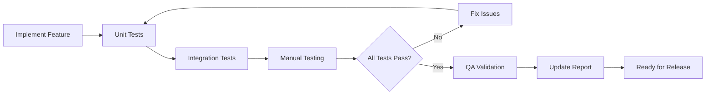

# QA Documentation

## Purpose
This directory contains quality assurance documentation, testing methodologies, validation checklists, and QA reports for the Rustbot project.

## Documents

### Testing Methodologies
- **[TESTING_METHODS.md](TESTING_METHODS.md)** - Comprehensive guide to testing approaches
  - Reading time: ~10 minutes
  - Audience: Developers, QA Engineers
  - Covers: Unit tests, integration tests, manual testing procedures

### Validation & Checklists
- **[QA_CHECKLIST.md](QA_CHECKLIST.md)** - Standard QA checklist for releases
  - Reading time: ~5 minutes
  - Audience: QA Engineers, Release Managers
  - Covers: Pre-release validation, feature verification, regression testing

- **[VERIFICATION_CHECKLIST.md](VERIFICATION_CHECKLIST.md)** - Verification checklist for specific features
  - Reading time: ~3 minutes
  - Audience: Developers, QA Engineers
  - Covers: Feature-specific verification steps

### QA Reports
- **[QA_VALIDATION_REPORT.md](QA_VALIDATION_REPORT.md)** - QA validation report template and examples
  - Reading time: ~8 minutes
  - Audience: All team members
  - Covers: Test results, issues found, validation status

## Recommended Reading Order

### For QA Engineers
1. Start with [TESTING_METHODS.md](TESTING_METHODS.md) to understand testing approaches
2. Review [QA_CHECKLIST.md](QA_CHECKLIST.md) for standard validation procedures
3. Use [VERIFICATION_CHECKLIST.md](VERIFICATION_CHECKLIST.md) for specific features
4. Document results in [QA_VALIDATION_REPORT.md](QA_VALIDATION_REPORT.md) format

### For Developers
1. Read [TESTING_METHODS.md](TESTING_METHODS.md) to understand testing requirements
2. Use [VERIFICATION_CHECKLIST.md](VERIFICATION_CHECKLIST.md) when implementing features
3. Review [QA_CHECKLIST.md](QA_CHECKLIST.md) before submitting PRs

### For Release Managers
1. Review [QA_CHECKLIST.md](QA_CHECKLIST.md) for release criteria
2. Verify [QA_VALIDATION_REPORT.md](QA_VALIDATION_REPORT.md) completion
3. Check [VERIFICATION_CHECKLIST.md](VERIFICATION_CHECKLIST.md) for critical features

## Testing Workflow

## Related Resources

- **[Architecture](../architecture/)** - Understand system design for better testing
- **[Guides](../guides/)** - Quick start guides for setup and usage
- **[Progress](../progress/)** - Session logs with testing notes
- **[Fixes](../fixes/)** - Bug fix documentation and testing

## QA Best Practices

### Before Testing
- Understand feature requirements
- Review architecture documentation
- Set up clean test environment
- Prepare test data

### During Testing
- Follow testing methodologies
- Document issues immediately
- Take screenshots/logs for bugs
- Test edge cases and error handling

### After Testing
- Complete validation reports
- Update test documentation
- File bugs in issue tracker
- Share results with team

## Creating QA Documentation

When creating new QA documentation:
1. Use templates from existing documents
2. Be specific and actionable
3. Include expected vs actual results
4. Add reproducible steps
5. Link to related issues/PRs
6. Update this README

## Quick Access by Task

- **Writing tests** → [TESTING_METHODS.md](TESTING_METHODS.md)
- **Validating release** → [QA_CHECKLIST.md](QA_CHECKLIST.md)
- **Verifying specific feature** → [VERIFICATION_CHECKLIST.md](VERIFICATION_CHECKLIST.md)
- **Documenting test results** → [QA_VALIDATION_REPORT.md](QA_VALIDATION_REPORT.md)
- **Understanding test coverage** → [TESTING_METHODS.md](TESTING_METHODS.md)

## Metrics & Coverage

For current test coverage and metrics, see:
- `cargo test` output
- CI/CD pipeline reports
- [QA_VALIDATION_REPORT.md](QA_VALIDATION_REPORT.md) for manual testing results

## Continuous Improvement

QA documentation should be updated when:
- New testing tools are adopted
- Testing processes change
- New feature areas require testing
- Bugs reveal gaps in testing
- Team feedback suggests improvements
